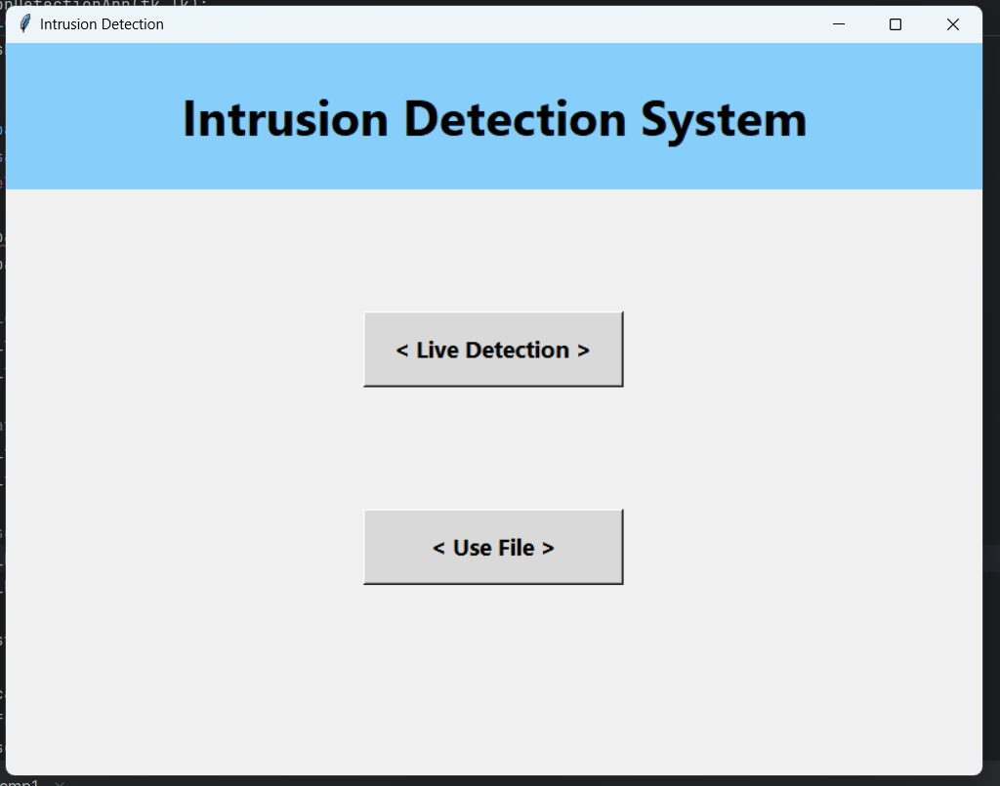
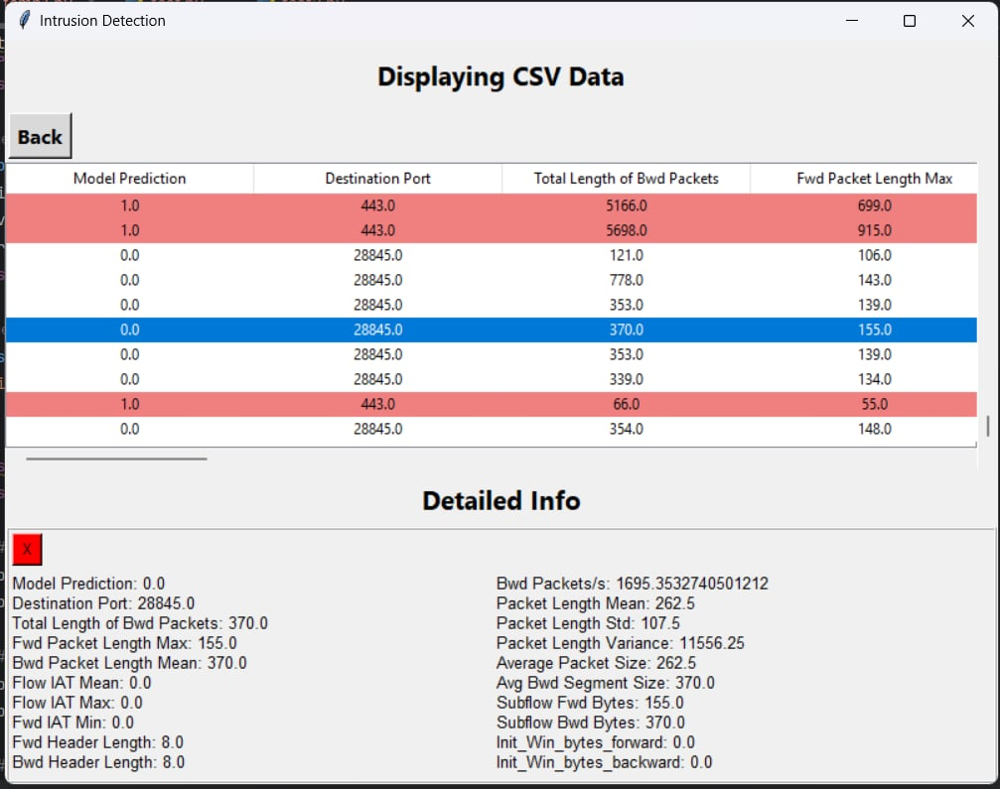
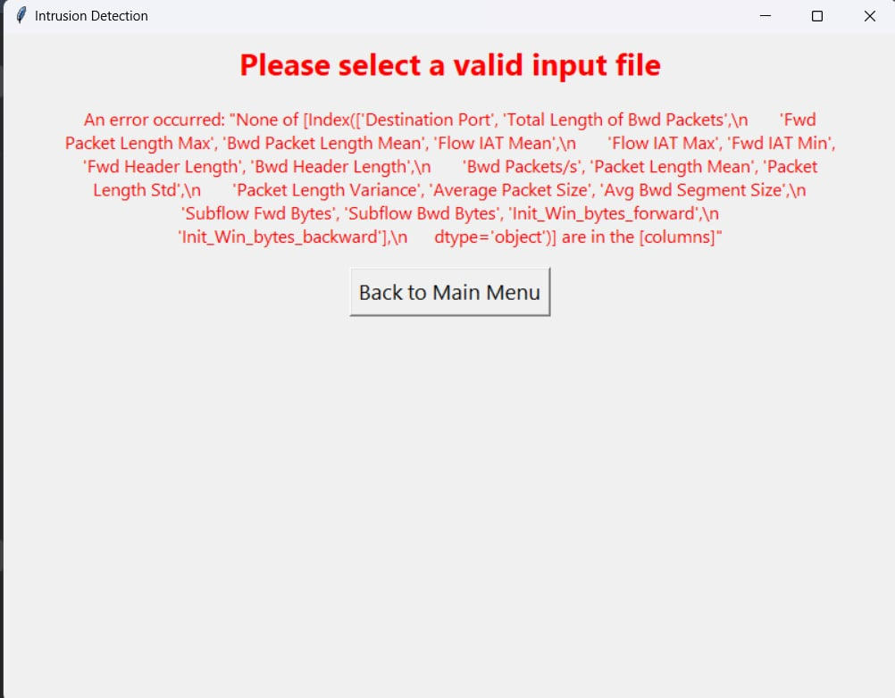

# Intrusion Detection System

This repository contains a Machine Learning-based Intrusion Detection System (IDS) designed to detect network intrusions in real-time as well as through historical data analysis. The system uses CICFlowMeter for network traffic feature extraction and supports live detection and retrospective analysis using stored data.

## Features

- **Real-Time Detection:** Monitor live network traffic to detect intrusions as they occur.
- **Historical Analysis:** Analyze previously captured data for potential threats.
- **Machine Learning:** Leverages trained ML models to identify anomalies in network traffic.
- **User-Friendly Interface:** Simple GUI for easy interaction with the system.

## Screenshots

### Main Interface
The main interface provides options for live detection or using a previously captured file for analysis.



### CSV Data Display
After uploading a file, the system displays the parsed CSV data along with model predictions.



### Error Handling
If an invalid file is uploaded, the system provides an error message to guide the user.



## Installation

1. Clone the repository:

    ```bash
    git clone https://github.com/UmmeKulsumTumpa/Intrusion-Detection-System.git
    cd Intrusion-Detection-System
    ```

2. Ensure that CICFlowMeter is set up and configured to capture network traffic and all the dependencies are installed.

## Usage

To run the Intrusion Detection System, execute the following command:

```bash
python /detection-app/temp.py
```

## Live Detection
- Select "Live Detection" on the main interface.
- The system will start monitoring the network traffic for any anomalies.
- Detected intrusions will be displayed in real-time, allowing you to take immediate action if necessary.


## Use File
- Select "Use File" on the main interface.
- Upload a CSV file containing network traffic data.
- The system will process the file and display the results, including detailed information for each record such as model predictions, destination ports, and various packet metrics.
- One can analyze the results to identify any potential intrusions within the recorded data.

